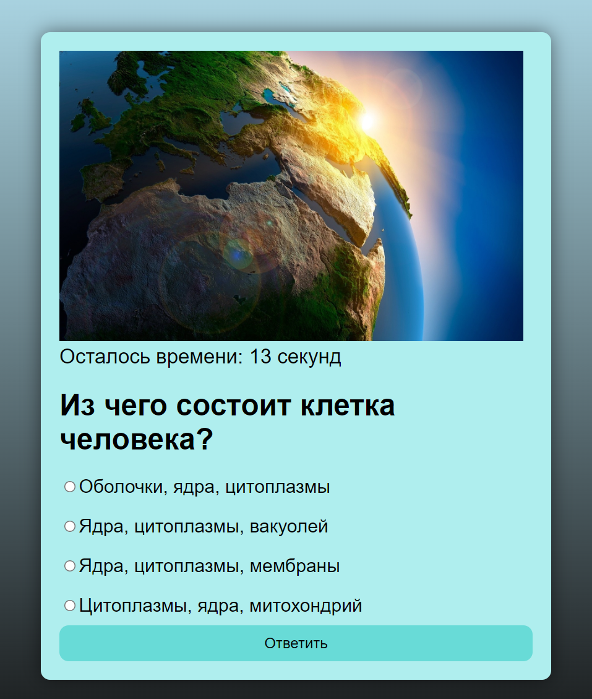

# инQUIZиторы
### Проект по созданию веб-серивса для проведения викторин
Виртуальная доска с архитектурой проекта: [Miro](https://miro.com/app/board/uXjVKYAm7KI=/?share_link_id=636091891881)

Такс-трекер: [Trello](https://trello.com/invite/b/qvJ2RUU8/ATTId2163f423ca66fd8f5b985ed965abafcEE3684B4/инquizиторы)

Веб-сервис включает в себя:
+ Регистрацию пользователей, вход в аккаунт и выход из аккаунта
+ Выбор темы викторины
+ Два режима игры:
  + Одиночную игру
  + Игру против других игроков
+ Создание комнат с мультиплеером
+ Создание собственных наборов вопросов с возможностью добавлять картинки

## Работа проекта:
### Запустив проект и перейдя по ссылке <http://127.0.0.1:5000>, можно увидеть начальную страницу:

### Нажатие на кнопку <u>Зарегистрироваться</u> переводит на страницу с анкетой для регистрации, в которой вводятся Никнейм, Email, Пароль и подтверждение пароля.

### Нажатие на кнопку <u>Войти</u> переводит на страницу входа, в которой вводятся Email и Пароль.

### После регистрации или входа происходит переход в профиль

### Для дальнейшего взаимодействия наведите на кнопку <u>Меню</u>

### По кнопке <u>Профиль</u> всегда можно вернуться в профиль пользователя
### Кнопка <u>Настройки</u> переводит на страницу где можно сменить аватарку

### По кнопке <u>Список викторин</u> перейти к списку всех викторин

####  Нажав на кнопку <u>Играть</u> под названием и описанием викторины, пользователь начнёт викторину

#### На каждый вопрос даётся 15 секунд на ответ, после запускается следующий вопрос
#### В конце викторины показывается результат

### Кнопка <u>Мультиплеер</u> переводит на страницу мультиплеера,где можно создать свою комнату, вписав название в поле ввода и нажав на кнопку <u>Создать комнату</u>, или присоединится к другой комнате по кнопке <u>Присоединиться</u> возле соответствующей комнаты

#### После попадания в комнату или её создания мы попадаем в лобби, где создатель комнаты выбирает викторину и, когда все игроки в сборе, запускает игру

#### После нажатия кнопки <u>Начать игру</u> у всех участников комнаты запускается игра, и после прохождения всеми игроками викторины будет выведен победитель

### Кнопка <u>Создать викторину</u> переводит на страницу для создания викторины. На странице подробно прописаны инструкции для создания викторины.

### Кнопка <u>Выйти из аккаунта</u> заканчивает сессию пользователя и переводит на начальную страницу